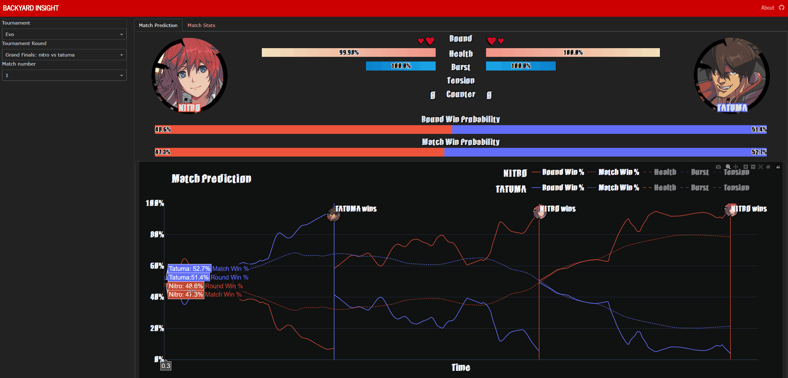

# Backyard Insight

The dashboard for the metrics created by [Backyard-Observer](https://github.com/tmltsang/Backyard-Observer) for game Guilty Gear -Strive-, hosted on [backyard-insight.info]()

For more information about the project, read [about.md](assets/text/about.md)

## Contributing
For the moment the dataset is not published. You can attempt to create the dataset using, [Backyard-Observer](https://github.com/tmltsang/Backyard-Observer). If you are interested in contributing, please contact me.

## Running locally
### Create venv and install dependencies
```bash
### pip and venv
python -m venv venv
source venv/bin/activate
python -r requirements.txt

### Conda
conda create --name backyard-insight --file conda-requirements.txt
conda activate backyard-insight
```

### .env

A `.env` file with the following is required
```
LOCAL_MATCH=<path to CSV file with match data>
LOCAL_MATCH_STATS=<path to CSV file with match stats data>
LOCAL_ASUKA=<path to CSV file with asuka data>
LOCAL=true
DEBUG=true
```
Support for Mongo is supported by

```
ATLAS_URI=<URI of Mongo Atlas being used>
DB_NAME=<Name of Database in Mongo>
COLLECTION_MATCH=<Name of collection with match data>
COLLECTION_MATCH_STATS=<Name of collection with match stats data>
COLLECTION_ASUKA_MATCH=<Name of collection with asuka data>
LOCAL=false
DEBUG=false
```
### Local
Make sure to activate the virtual env and then
```
python app.py
```

The service can be accessed via `127.0.0.1:8050`

### Docker
Add `IS_DOCKER=true` to `.env`

```bash
#Build
docker build -t backyard-insight .

#Deploy
docker run --rm -v "/${PWD}/.env:/root/.env"  -p 4500:10000 --name backyard-insight backyard-insight
```
The service can be accessed via `localhost:4500`

## Author
Thomas Tsang (thomas.ml.tsang@gmail.com)